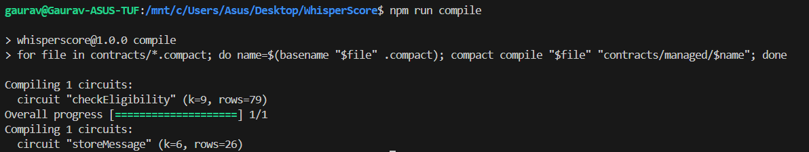

# WhisperScore
> WhisperScore lets users prove they meet a threshold to access a service without ever revealing the actual number.

## Contract Address
| Network  | Address                                                            |
|----------|--------------------------------------------------------------------|
| Preview  | `16be13f4d0aa666121fc6be71836e99d88cdbb1ce25e2438c559304d7a9cf10f` |

## What This Does
WhisperScore replaces full data disclosure with programmable selective disclosure. A user can prove “my FICO score > 700” or “I have completed ≥ 10 gym sessions this month” without giving away the precise number. A verifier receives only a cryptographic “yes/no” proof that the user’s private value meets the required cutoff.

## Privacy Model
- What is PUBLIC (on-chain, visible to anyone): The required threshold (e.g., 700) and the final boolean result (Eligible/Not Eligible).
- What is PRIVATE (private witness, never on-chain): The user's actual value (e.g., their exact credit score or exact number of gym visits).
- What the user PROVES without revealing: That their private value is greater than or equal to the public threshold, computed securely using a zero-knowledge circuit.

## Tech Stack
- Midnight network, Compact language, Node.js v22, Docker

## Prerequisites
- Node.js v22
- Docker daemon running
- Midnight Compact Compiler

## Setup
1. Clone the repository
2. Run `npm install`
3. Ensure Docker is running and run `docker run -d -p 6300:6300 midnightnetwork/proof-server`
4. Compile the contract using `compact compile`

## Run Tests
Run `npm test` to execute the test suite covering circuit logic and privacy constraints.

## Initial Idea
WhisperScore lets users prove they meet a threshold (credit score, income level, health metric, membership tier) to access a service, discount, or loan—without ever revealing the actual number or underlying documents. A verifier (e.g., a lender, gym, insurer) receives only a cryptographic “yes/no” proof that the user’s private value is above (or below) a required cutoff. The user’s data stays encrypted on Midnight’s shielded ledger; the business sees only the proof they need for compliance or business logic.

## Screenshots
