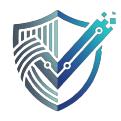

# WhisperScore

> Prove your professional identity, protect your data.

## Live Demo
[https://whisper-score-steel.vercel.app/](https://whisper-score-steel.vercel.app/)

## Contract Address
| Network  | Address                                                              |
|----------|----------------------------------------------------------------------|
| Preview  | `16be13f4d0aa666121fc6be71836e99d88cdbb1ce25e2438c559304d7a9cf10f`   |
| Preprod  | `32587300f95d1620fecbeb4914ef1be44b95e7a3cbd659e661d38ba83827871d`   |

## Level 5 - User Validation & Iteration
- **Target:** 50 Preprod users
- **Current Verified:** 50 / 50
- **User Directory:** See [`USERS.md`](./USERS.md) for full verified addresses.
- **Feedback & Changes:** See [`docs/FEEDBACK.md`](./docs/FEEDBACK.md) for raw feedback logs, feedback themes, and applied code iterations.

### UI & UX Improvements Implemented in Level 5:
* **Gas Onboarding:** Added direct Midnight Preprod faucet assistance inside the wallet connection card.
* **ZK Prover Feedback:** Integrated async status loaders during Compact witness and proof generation to lock UI controls.
* **Input Sanitization:** Guarded proof execution against negative/decimal values with native frontend validation.
* **Context Legend:** Added Bronze, Silver, and Gold tier breakdowns for threshold comparisons.

## What This Product Does
WhisperScore acts as an omni-chain reputation and Sybil resistance oracle. Currently, to prove "power user" status for premium airdrops, DAO voting weight, or undercollateralized loans, users are forced to publicly link their scattered Web3 wallets (exposing cold storage vaults to hot wallets). 

WhisperScore replaces this with programmable selective disclosure. A user can locally aggregate their transaction history and prove "my total accumulated volume across all my wallets > $10,000" or "my wallets are older than 1 year" without ever publishing those addresses on-chain. The verifying protocol receives only a cryptographic "yes/no" proof.

By leveraging the Midnight Network, WhisperScore utilizes zero-knowledge (ZK) circuits to compute score tiers locally on the user's machine. Users can confidently interact with platforms that require reputation verification while maintaining total sovereignty over their sensitive information.

## Privacy Model
- **What is PUBLIC:** The required threshold (e.g., cumulative volume > $10,000), the total global `eligibleCount`, and the final boolean attestation (Verified Power User / Not Verified).
- **What is PRIVATE:** The user's actual wallet addresses, exact `externalChainBalance`, raw transaction histories, and the `stateSignature` linking their fragmented accounts.
- **What the user PROVES without revealing:** That the aggregated metrics of their privately controlled wallets meet or exceed the public threshold, computed securely using a local zero-knowledge circuit, entirely protecting them from graph-based wallet surveillance.

## Privacy Claim
On-chain observers can see that an identity attestation was executed and verified against the Compact circuit, but they cannot deduce the specific private wallet addresses or financial data used by the user to generate the proof locally. This protects the user entirely from graph-based wallet surveillance while still allowing them to leverage their reputation.

## Tech Stack
* **Smart Contract:** Midnight Compact
* **Frontend:** React, TypeScript, Vite, Midnight.js SDK
* **Wallet Integration:** Lace Wallet API
* **Testing:** Jest

## Prerequisites
* [Node.js v22+](https://nodejs.org/)
* Docker daemon running
* [Lace Wallet](https://www.lace.io/) (Configured for Midnight Preprod)
* tDUST (testnet tokens) for gas fees

## Setup & Run Locally
1. Clone the repository: `git clone https://github.com/GauravKarakoti/WhisperScore.git`
2. Navigate to the project directory: `cd WhisperScore`
3. Install dependencies: `npm install`
4. Start the local proof server: `docker run -d -p 6300:6300 midnightnetwork/proof-server`
5. Compile the contract: `npm run compile` (or `compact compile`)
6. Start the frontend development server: `npm run dev`

## Run Tests
Run `npm test` to execute the test suite covering circuit logic, cross-chain state aggregation, and privacy constraints.

## CI/CD
This project uses GitHub Actions for Continuous Integration. On every push to the `main` branch, the pipeline automatically checks out the code, sets up Node v22, installs the Compact CLI, compiles the contract, and runs the test suite.

## [Product Proposal](./Proposal.md)

## Usage Guide
See [`docs/USAGE.md`](./docs/USAGE.md)

## The Core Concept
WhisperScore is a decentralized omni-chain reputation protocol built on the Midnight Network that allows users to cryptographically prove their cumulative "power user" status across multiple fragmented Web3 wallets without doxxing their transaction history or exposing themselves to graph-based wallet surveillance. By aggregating state data from various addresses locally, WhisperScore utilizes a Midnight Compact circuit to verify that the user's combined metrics meet a specific smart contract threshold, subsequently emitting a shielded binary attestation to the public ledger. This provides dApps, DAOs, and lending platforms with a highly reliable, Sybil-resistant credential while empowering users to leverage their hard-earned cross-chain reputation without sacrificing their financial privacy.

## Feedback & Iterations
See [`docs/FEEDBACK.md`](./docs/FEEDBACK.md) for full details.
Summary of top changes made from user feedback:
* **Gas Onboarding:** Added a tDUST faucet banner to prevent zero-gas transaction failures for first-time Preprod testers.
* **Prover Latency & UI Locking:** Implemented a frontend loading spinner and disabled button states during local ZK proof generation to prevent accidental double-clicking.
* **Input Validation & Context:** Added client-side input validation for positive numbers to prevent circuit crashes, along with a visual tier legend (Bronze, Silver, Gold) for scoring context.

## Level 6 Users
See [`LAUNCH_USERS.md`](./LAUNCH_USERS.md)

## Product X Account
[Product X Account](https://x.com/WhisperScore)

## Brand Logo

## Demo Video & Screenshots

**Demo Video:** [PLACEHOLDER — Add the link after recording]

## Security Assumptions
* **Circuit Bounds:** The `checkEligibility` circuit enforces a hardcap on `externalChainBalance` (`1,000,000,000`) to prevent overflow exploits during the Field-to-Uint conversion.
* **Prover Isolation:** Proofs are strictly generated on the client side. The wallet daemon passes the compiled witness directly to the local Midnight proof server, ensuring the private key and signature inputs never touch the network layer.