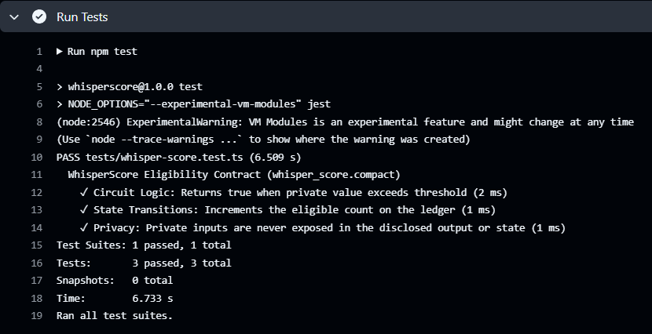

# WhisperScore

> A decentralized identity and reputation protocol built on the Midnight Network that allows users to cryptographically prove their cumulative "power user" status without ever linking their wallets publicly or exposing their exact financial history.

## [Live Demo](https://whisper-score-steel.vercel.app/)

## Contract Address
| Network  | Address                                                            |
|----------|--------------------------------------------------------------------|
| Preview  | `16be13f4d0aa666121fc6be71836e99d88cdbb1ce25e2438c559304d7a9cf10f` |
| Preprod  | `63f6806d5ebdcf5b1f18fea225fe993ebd956df5979d21d071a53e6813e3192e` |

## What This Does
WhisperScore acts as an omni-chain reputation and Sybil resistance oracle. Currently, to prove "power user" status for premium airdrops, DAO voting weight, or undercollateralized loans, users are forced to publicly link their scattered Web3 wallets (exposing cold storage vaults to hot wallets). 

WhisperScore replaces this with programmable selective disclosure. A user can locally aggregate their transaction history and prove "my total accumulated volume across all my wallets > $10,000" or "my wallets are older than 1 year" without ever publishing those addresses on-chain. The verifying protocol receives only a cryptographic "yes/no" proof.

## Privacy Model
- **What is PUBLIC (on-chain, visible to anyone):** The required threshold (e.g., cumulative volume > $10,000) and the final boolean attestation (Verified Power User / Not Verified).
- **What is PRIVATE (private witness, never on-chain):** The user's actual wallet addresses, exact balances, raw transaction histories, and the links between their fragmented accounts.
- **What the user PROVES without revealing:** That the aggregated metrics of their privately controlled wallets meet or exceed the public threshold, computed securely using a local zero-knowledge circuit.

## Privacy Claim
On-chain observers can see that an identity attestation was executed and verified against the Compact circuit, but they cannot deduce the specific private wallet addresses or financial data used by the user to generate the proof locally. This protects the user entirely from graph-based wallet surveillance while still allowing them to leverage their reputation.

## Tech Stack
- Midnight Network, Compact, Midnight.js SDK, React/Vite, Lace Wallet, Node.js v22, Docker

## Prerequisites
- Node.js v22
- Docker daemon running
- Midnight Compact Compiler
- Lace wallet installed (configured for Midnight Preprod)

## Setup
1. Clone the repository
2. Run `npm install`
3. Ensure Docker is running and execute: `docker run -d -p 6300:6300 midnightnetwork/proof-server`
4. Compile the contract using `compact compile`

## Run Tests
Run `npm test` to execute the test suite covering circuit logic, cross-chain state aggregation, and privacy constraints.

## CI/CD
This project uses GitHub Actions to run a CI/CD pipeline. On every push to the `main` branch, the pipeline checks out the code, installs dependencies, compiles the Compact smart contract, and runs the test suite to ensure no breaking changes are introduced.

## [Product Proposal](./Proposal.md)

## The Core Concept
WhisperScore is a decentralized omni-chain reputation protocol built on the Midnight Network that allows users to cryptographically prove their cumulative "power user" status across multiple fragmented Web3 wallets without doxxing their transaction history or exposing themselves to graph-based wallet surveillance. By aggregating state data from various addresses locally, WhisperScore utilizes a Midnight Compact circuit to verify that the user's combined metrics meet a specific smart contract threshold, subsequently emitting a shielded binary attestation to the public ledger. This provides dApps, DAOs, and lending platforms with a highly reliable, Sybil-resistant credential while empowering users to leverage their hard-earned cross-chain reputation without sacrificing their financial privacy.

## Screenshots

## Demo Video
[PLACEHOLDER — I will add the link after recording]